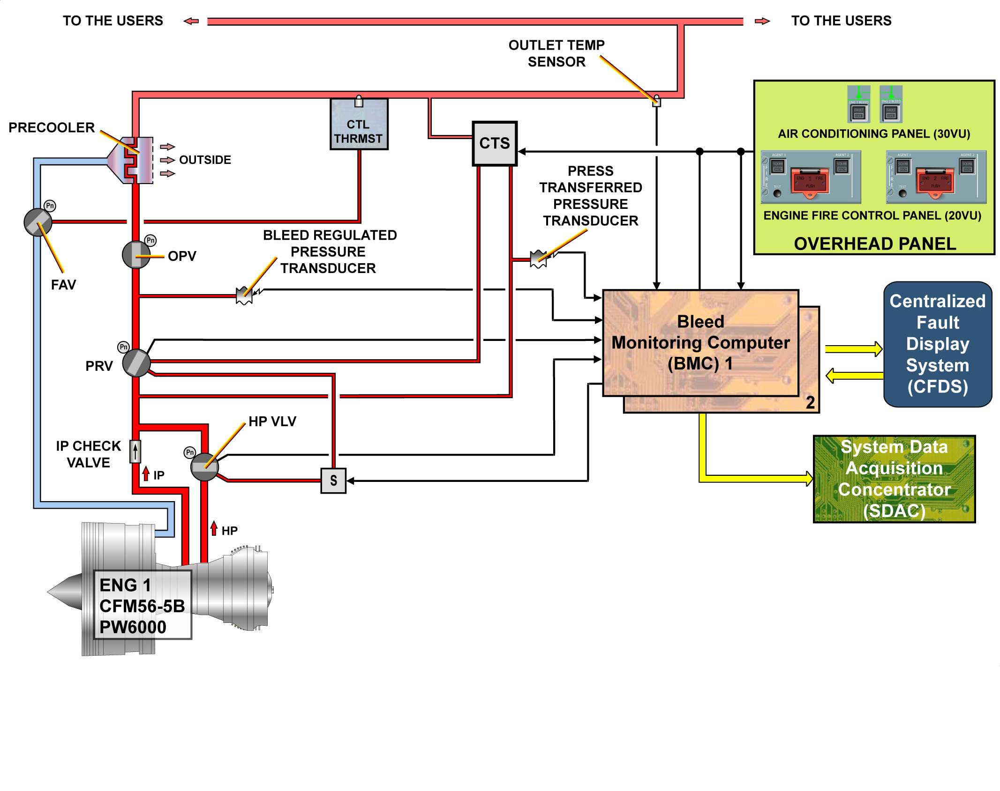
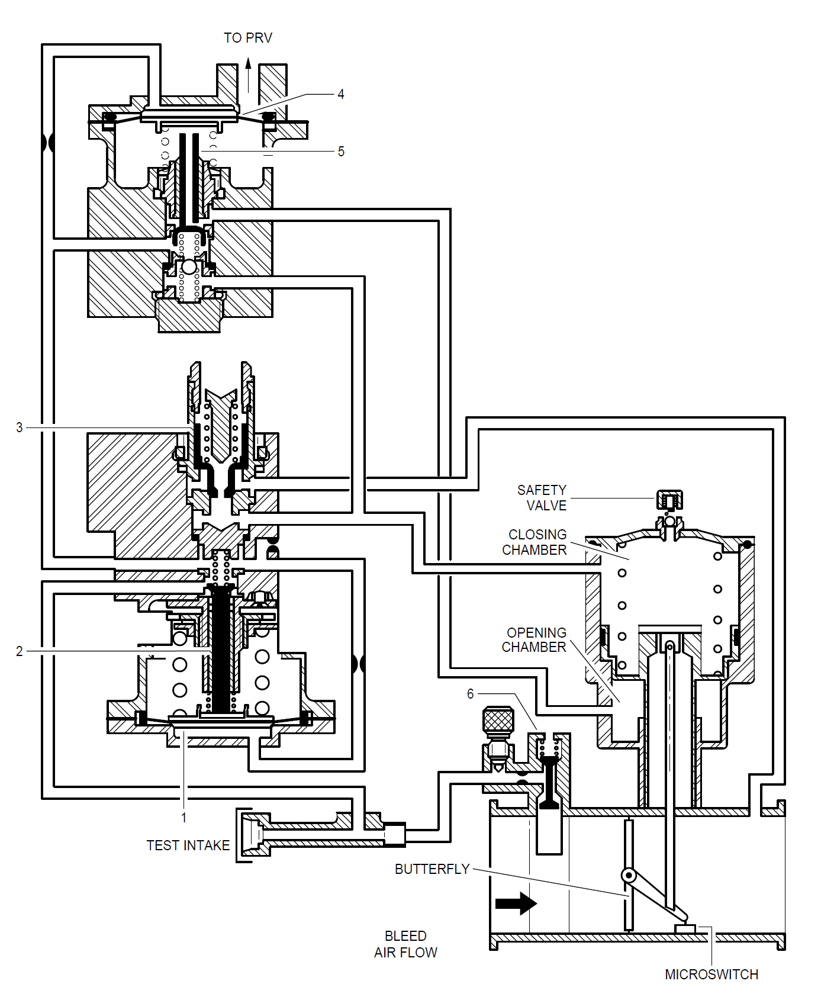

# ATA-36-空气系统(引气系统)

引气系统有三大引气来源：

- [左右发动机引气(CFM56)](#_36-11-发动机引气)，发动机引气是飞行中的主要引气来源
- [APU引气](#_36-12-apu引气)，APU引气是地面上的主要引气来源，当然，在飞行高度不高于20000ft时，APU也可以在飞行中提供引气
- [地面高压气源](#_36-13-地面高压气源)，在地面上，地面高压气源可以代替APU引气使用，它通过地面高压接头直接将空气引入管道

## 36-11-发动机引气

上图为左发的示意图，从图中看到，发动机引气有几个关键部件：

- 高压引气活门 - `HPV`
- 中压单向活门 - `IPCV`
- 压力调节活门 - `PRV`
- 超压活门 - `OPV`
- 风扇引气活门 - `FAV`
- 预冷器

### HPV

HPV是一个电控气动的蝶形阀，当它的上游气压不足时，由于弹簧负载的作用而处于关闭状态。  
在发动机开始启动至慢车位的过程中，由于转速较低，导致压气机前几级的压力较低，无法提供足够的引气压力，所以，空气得从压气机压力较高的后几级中抽出。  
CFM56发动机是在压气机的第9级（高压级）抽取空气，在发动机的加速过程中，当高压级的压力达到至少8psi时，作用在HPV阀门上的力超过弹簧的力，从而HPV的蝶形阀被压力顶开，空气开始进入管道。

从上面的结构示意图可以看出，HPV的口子并不能完全打开，蝶形阀开到满位时也只能打开大约一半的口子让空气通过，这样设计的目的是为了让HPV能够调节其下游的空气静压，这个静压最高不能超过36psi(允许向下偏差3psi)，显然，高压级的压力越大，蝶形阀的开度就越大，下游的静压也就越高，因此，HPV能调节的下游静压在8~36psi。  
当HPV的上游静压达到120psi(允许向下偏差10psi，向上偏差5psi)时，HPV又会完全关闭，这时，空气就只能从IPCV引入。

### IPCV

IPCV是一个普通的单向活门，它不能调节压力，当高压级引气时，空气倒流至IPCV的下游时，在压差作用下，阀门关闭，从而防止空气倒流回压气机的中压级。  
当CFM56发动机的压气机第5级(中压级)的压力足够引气时，HPV就会关闭，发动机从中压级引气，从而减少压气机的能量损失。

### PRV

### OPV

### FAV

### 预冷器

## 36-12-APU引气

## 36-13-地面高压气源

## 36-14-环境保护

## 36-22-渗漏检测