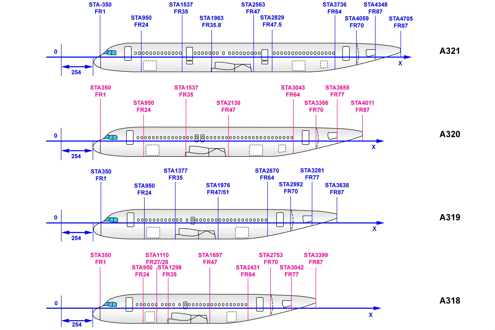

::: warning 正在搞
[ATA-36-Pneumatic(点击查看)](#ata-36-pneumatic)
:::

::: danger 还没搞
ATA-31（一）-Indicating  
ATA-31（二）-Recording Systems  
ATA-25-Equipment && Furnishings  
ATA-24-Electrical Power  
ATA-26-Fire Protection  
ATA-32-Landing Gear  
ATA-35-Oxygen  
ATA-28-Fuel  
ATA-33-Lights  
ATA-21-Air Conditioning  
ATA-38-Water && Waste  
ATA-29-Hydraulic Power  
ATA-30-Ice && Rain Protection  
ATA-47-Inert Gas System  
ATA-49-APU  
ATA-70-Power Plant(CFM56)  
ATA-51-Structure  
ATA-52-Doors  
ATA-22-Auto Flight  
ATA-27-Flight Controls  
ATA-23-Communications  
ATA-34-Navigation  
ATA-46-Information Systems
:::
# A320FM

A320FM系列主要有A318、A319、A320和A321几个型号，还有新出的改进型A320neo以及一些公务机型号，
由于A319/A320/A321在国内很常见，所以主要学习A319/A320/A321的异同

::: danger TODO
## ATA-31（一）-Indicating
:::
这部分主要介绍EIS、时钟、CFDS、打印机
::: danger TODO
## ATA-31（二）-Recording Systems
:::
这部分主要介绍FDIMU、QAR、SSFDR、CVR
::: danger TODO
## ATA-25-Equipment && Furnishings
:::
::: danger TODO
## ATA-24-Electrical Power
:::
::: danger TODO
## ATA-26-Fire Protection
:::
::: danger TODO
## ATA-32-Landing Gear
:::
::: danger TODO
## ATA-35-Oxygen
:::
::: danger TODO
## ATA-28-Fuel
:::
::: danger TODO
## ATA-33-Lights
:::

## [ATA-36-Pneumatic](./36/ATA36.md)

空气系统(引气系统)提供高压空气，以保障飞机的某些系统或功能正常工作，这些系统或功能包括：

- 大翼防冰系统
- 空调系统
- 发动机启动系统
- 液压油箱增压系统
- 水增压系统
- 发动机短舱防冰活门的伺服增压

两个`引气监控计算机`Bleed-Air Monitoring Computer(`BMC`)负责监控和管理引气系统，正常情况下，空气系统由`BMC`自动控制，但是也可以通过驾驶舱头顶面板(`30VU`)上的一些按钮或旋钮来人工控制。  
SD的引气页面上可以看到一些工作参数和状态。  
[更多......](./36/ATA36.md)

::: danger TODO
## ATA-21-Air Conditioning
:::
::: danger TODO
## ATA-38-Water && Waste
:::
::: danger TODO
## ATA-29-Hydraulic Power
:::
::: danger TODO
## ATA-30-Ice && Rain Protection
:::
::: danger TODO
## ATA-47-Inert Gas System
:::
::: danger TODO
## ATA-49-APU
:::
::: danger TODO
## ATA-70-Power Plant(CFM56)
:::
::: danger TODO
## ATA-51-Structure
:::
::: danger TODO
## ATA-52-Doors
:::
::: danger TODO
## ATA-22-Auto Flight
:::
::: danger TODO
## ATA-27-Flight Controls
:::
::: danger TODO
## ATA-23-Communications
:::
::: danger TODO
## ATA-34-Navigation
:::
::: danger TODO
## ATA-46-Information Systems
:::